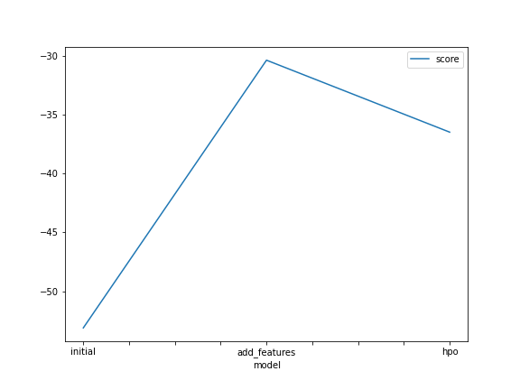
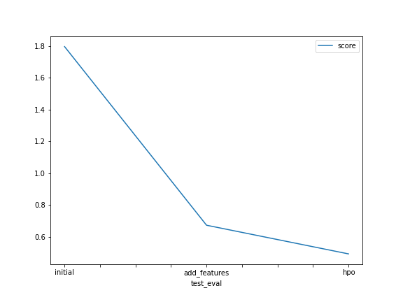

# Report: Predict Bike Sharing Demand with AutoGluon Solution
#### Sanchit Tomar

## Initial Training
### What did you realize when you tried to submit your predictions? What changes were needed to the output of the predictor to submit your results?
TODO: For my Predictions no changes were needed, but In case there are negative values in the predictions then those negative values needed to be set to 0 as kaggle does not accept negative values for this submission.

### What was the top ranked model that performed?
TODO: WeightedEnsemble_L3 in NN_TORCH is the top ranked model that performed

## Exploratory data analysis and feature creation
### What did the exploratory analysis find and how did you add additional features?
TODO: Visualizing the data revealed that the datetime column can be used to extract different features like hour, month and day and adding these features to the data helped a lot cause there were certain hours, days and months that had an increase in demand

### How much better did your model preform after adding additional features and why do you think that is?
TODO: After adding additional features the model score was improved by almost 2 times and I think the reason for that is because those additional features i.e. hour, day and month are possitively correlated to the demand and previously these features were combined in one column

## Hyper parameter tuning
### How much better did your model preform after trying different hyper parameters?
TODO: There was a slight increase in performance but not that big of a difference

### If you were given more time with this dataset, where do you think you would spend more time?
TODO: I think I would spend more in hyperparameter tuning but feature engineering can also help improve the performance even further

### Create a table with the models you ran, the hyperparameters modified, and the kaggle score.
|model|GBM|NN_TORCH|CAT|score|
|--|--|--|--|--|
|initial|{}|{}|{}|1.79507|
|add_features|{}|{}|{}|0.67263|
|hpo|{  'num_boost_round': 100, 'num_leaves': ag.space.Int(lower=26, upper=66, default=36), }|{ 'num_epochs': 10, 'learning_rate': ag.space.Real(1e-4, 1e-2, default=5e-4, log=True),'activation': ag.space.Categorical('relu', 'softrelu', 'tanh'),'dropout_prob': ag.space.Real(0.0, 0.5, default=0.1),}|{'learning_rate': ag.space.Real(1e-4, 1e-2, default=5e-4, log=True),}|0.49255|

### Create a line plot showing the top model score for the three (or more) training runs during the project.

TODO: Replace the image below with your own.

### Create a line plot showing the top kaggle score for the three (or more) prediction submissions during the project.

TODO: Replace the image below with your own.

## Summary
TODO: In this project, I analyzed a bike sharing demand dataset to predict the number of bikes required based on various factors. Initially, I used the raw data without any modifications and built a predictive model. However, to enhance the model's performance, I performed feature engineering by extracting additional features such as hour, day, and month from the datetime column.
By including these extracted features, the model gained a better understanding of temporal patterns and improved its accuracy in predicting bike demand. This feature engineering step helped capture the influence of specific time periods on bike usage, such as rush hours or seasonal variations.
After implementing the feature engineering, I further optimized the model by tuning its hyperparameters
Overall, by leveraging feature engineering techniques and fine-tuning the model's hyperparameters, I was able to enhance its performance in predicting bike sharing demand. These steps helped uncover valuable insights and increased the accuracy of the model's predictions, contributing to a more efficient and effective bike sharing system.
